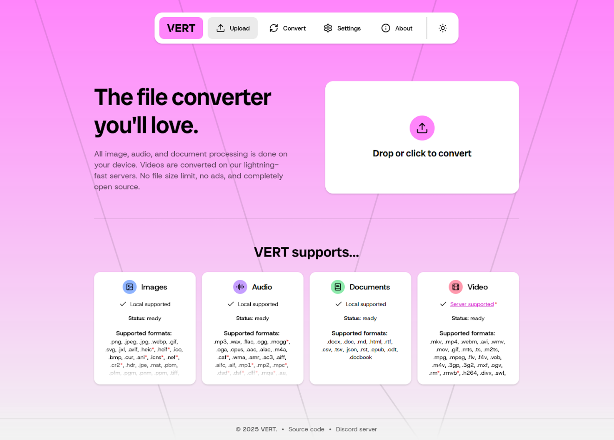
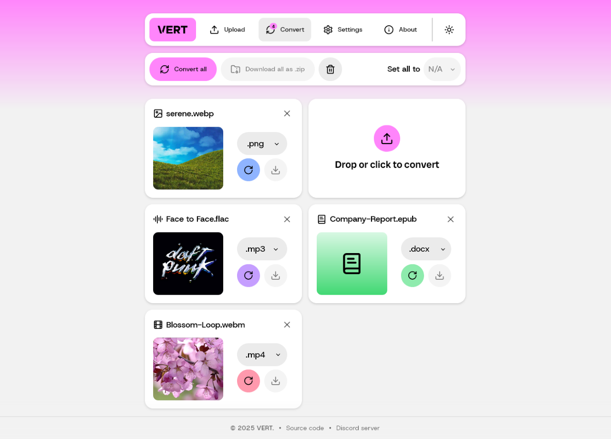

  

<h1 align="center">⚡ vert-pro</h1>

  <strong>Ultra-lightweight, privacy-first, self-hosted file conversion & manipulation</strong> 
  Built on <a href="https://vert.sh">VERT</a> — enhanced for power users.

---

**vert-pro** is an enhanced, feature-rich fork of the open-source [VERT](https://github.com/VERT-sh/VERT) project. It is designed as an ultra-lightweight, privacy-first, self-hosted alternative to CloudConvert for mainstream files.

While the original VERT delivers incredible format-to-format conversion, **vert-pro** bridges the gap for home server enthusiasts by adding crucial structural manipulation tools — like **visually merging, splitting, and compressing** everyday documents and images — without adding an ounce of server bloat.

## Screenshots

|                     Upload page                      |                     Conversion page                      |
| :--------------------------------------------------: | :------------------------------------------------------: |
|  |  |

## 🧠 Architecture: Why It's Different

Traditional self-hosted converters pull in massive 1.5GB+ Docker images containing full server-side runtimes (like LibreOffice or Python libraries), heavily taxing your server's CPU.

**vert-pro** keeps the server footprint tiny (~100MB) and server CPU strain at **0%** by shifting all processing logic to the client's web browser using **WebAssembly (WASM)**.

## ✨ Features

### Extended Feature Set (Beyond Upstream VERT)
- 🔀 **File Merging & Splitting:** Combine multiple files or extract specific pages from documents instantly in the browser using `pdf-lib`.
- 📉 **Client-Side Compression:** Shrink and optimize image and document sizes via adjustable UI sliders tapping directly into local WASM processing.
- 🔄 **Mainstream Format Conversion:** Inherits VERT's core ability to swap between Markdown, PDF, DOCX, TXT, JPEG, PNG, WebP, and SVG.
- 📱 **Android & iOS Friendly:** Fully responsive web interface where the mobile browser executes the WebAssembly code flawlessly.
- 🔒 **Air-Gapped Privacy:** 100% local processing. Your personal data never leaves your client device.

### Core VERT Features
- Convert files directly on your device using WebAssembly\*
- No file or file size limits
- Convert images, audio, documents, and video\*
- Supports over **250+** file formats
- Conversion settings
- User-friendly interface built with Svelte

\* Non-local video conversion is available with our official instance, but the [daemon](https://github.com/VERT-sh/vertd) is easily self-hostable to maintain privacy and fully local functionality.

## 📚 Documentation

- [FAQ](./docs/FAQ.md)
- [Getting Started](./docs/GETTING_STARTED.md)
- [Using Docker](./docs/DOCKER.md)
- [Video Conversion](./docs/VIDEO_CONVERSION.md)

## 🔄 Upstream Documentation

This project is built on [VERT](https://github.com/VERT-sh/VERT). For the original upstream documentation, see **[UPSTREAM-README.md](./UPSTREAM-README.md)**.

## 👥 Contributing

Refer to our contributing guidelines before opening an issue or pull request here: [CONTRIBUTING.md](./CONTRIBUTING.md)

## 📄 License

This project is licensed under the **AGPL-3.0 License**. Please see the [LICENSE](LICENSE) file for details.

## ⭐ Star History

<a href="https://star-history.dera.page/#VERT-sh/VERT&Date">
 <picture>
   <source media="(prefers-color-scheme: dark)" srcset="https://star-history.dera.page/svg?repos=VERT-sh/VERT&type=Date&theme=dark" />
   <source media="(prefers-color-scheme: light)" srcset="https://star-history.dera.page/svg?repos=VERT-sh/VERT&type=Date" />
   
 </picture>
</a>
